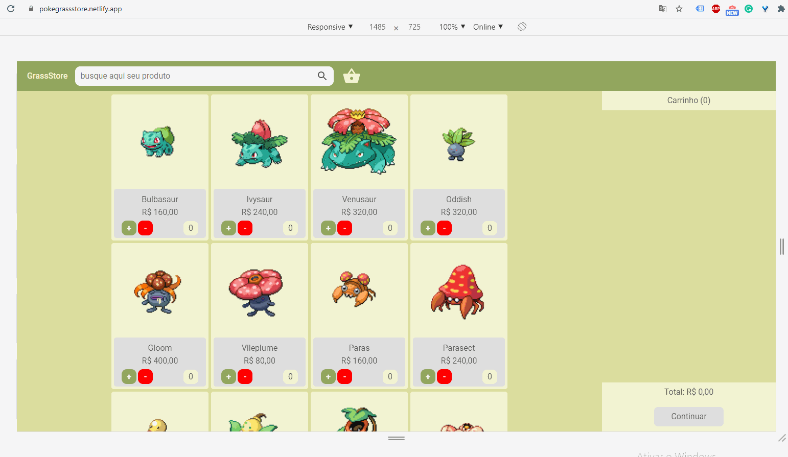

# React Ecommerce Challenge

## Description

The project is the result of a react challenge. The challenge proposal was to develop an reusable codebase for a responsive ecommerce application using ReactJS. Technologies I used:
ReactJS, ContextAPI and Styled Components.

Demo1: http://pokegrassstore.netlify.app/

Demo2: https://pokedragonstore.netlify.app/

## Instructions

In the project directory, you can run:

### `npm install`

### `npm start`
